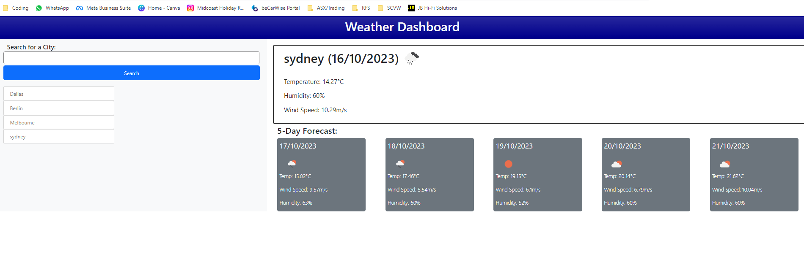
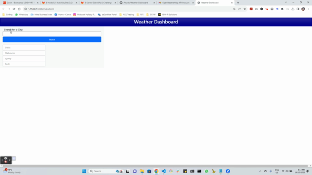

# Weather-Dashboard

## Description
The aim of this challenge was to create a Weather Dashboard that using the input of a city name, will return the current weather details for that day as well as a forecast for the next 5 days.

The returned details include - Temperature, Wind Speed and Humidity.

Each section is also returns the date and icons to reflect the weather outlook.

The dashboard is powered by the OpenWeatherMap API.

## Usage
A link to access the website, screenshot and video demonstration of the page is below...

https://petarlo.github.io/Weather-Dashboard/

## Credits
### API's used
Open Weather Map - https://openweathermap.org/  
Bootstrap - https://getbootstrap.com/  
jQuery - https://jquery.com/  
dayJS - https://day.js.org/en/
